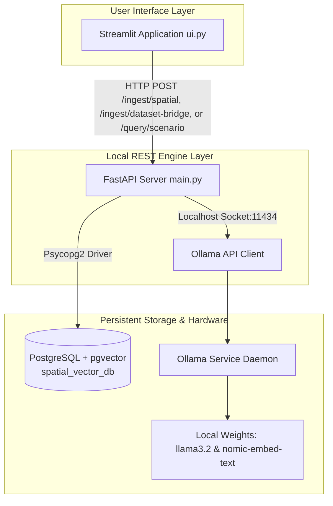
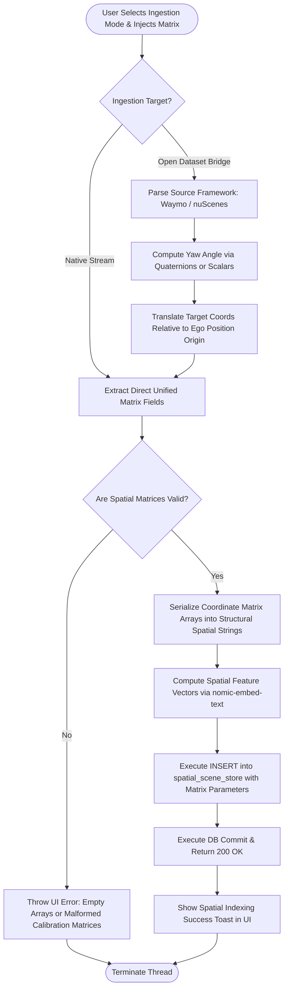

# Local 3D Scene Discovery & Volumetric Object Retrieval Engine

A fully local, high-leverage Spatial Telemetry Retrieval Engine running Retrieval-Augmented Generation (RAG) over multi-dimensional physical coordinate systems. Ingest structured 3D vehicle sequence logs, camera calibration matrices, and open autonomous tracking datasets to query, isolate, and reconstruct complex driving scenarios entirely on local machine infrastructure.

## What It Does

1. **Spatial Ingestion & Translation** — Drop time-series sequence logs (JSON metadata from nuScenes, Waymo Open Dataset, or custom IPM-processed Miata GoPro telemetry). The backend natively digests flat tracking layouts or routes raw parameters through an automated **Dataset Bridge Layer** to resolve coordinate space variations. The system extracts ego-vehicle velocity states, converts orientation Quaternions ($q = [w, x, y, z]$) into continuous yaw angles, and calculates local relative tracking coordinates.
2. **Dense Vector Topology Mapping** — Serializes multi-dimensional spatial constraints into structural geometric text blocks, generates 768-dimensional feature embeddings via `nomic-embed-text` using Ollama, and indexes them within a local PostgreSQL instance clustered with the `pgvector` extension.
3. **Deterministic Query Pipeline** — Input a structural trajectory scenario or constraint profile (e.g., identifying target vectors matching explicit distance, relative heading, or occlusion parameters). The top 3 closest spatial frames are isolated and passed to a zero-temperature `llama3.2` model to generate a grounded physics summary or automatically seed state-space initialization vectors ($x = [X, Y, \dot{X}, \dot{Y}]^T$) for downstream tracking filters.

## Requirements

- Python 3.10+ (project optimized for 3.14)
- [PostgreSQL](https://www.postgresql.org/) running locally on port `5432`
- [Ollama](https://ollama.com/) installed with local weights loaded

## Setup

### 1. PostgreSQL Spatial Database Configuration

Create your physical data cluster and ensure your configuration parameters map explicitly to the local tracking layer:

```sql
CREATE DATABASE spatial_vector_db;
\c spatial_vector_db
CREATE EXTENSION IF NOT EXISTS vector;
```

The underlying `spatial_scene_store` matrix layout is verified and compiled automatically by the FastAPI backend infrastructure on the initial execution loop.

### 2. Python Host Environment Setup

Initialize your virtual environment fleet and compile dependencies:

```bash
python -m venv venv
source venv/bin/activate         # Windows: venv\Scripts\activate
pip install fastapi uvicorn psycopg2-binary pgvector ollama streamlit requests
```

### 3. Local Model Weight Verification

Ensure your local Ollama daemon has the correct target weights pulled to compute spatial features and generate structured summaries:

```bash
ollama pull nomic-embed-text
ollama pull llama3.2
```

## Running the Project

Launch both execution threads in separate terminal windows with active virtual environments.

### Terminal 1 — Local REST Engine Layer Backend:

```bash
python main.py
```

The server binds to the local host address at http://127.0.0.1:8000.

### Terminal 2 — Spatial User Interface Frontend:

```bash
streamlit run ui.py
```

The browser pipeline instantiates the workspace view at http://localhost:8501.

## Usage

1. Navigate to the Ingestion Workspace in the Streamlit application.

2. Use the Native Stream Payload tab to paste raw, unified 3D coordinate arrays, or switch to the Real-World Dataset Bridge tab to process raw, untransformed coordinates from heterogeneous open-source autonomous tracking files.

3. Click the respective integration trigger to normalize, index, and register the geometric variables into your active `spatial_vector_db` instance.

4. Use the Conversational Query Workspace to run similarity evaluations and output precise state vector equations (`x = [X, Y, V_x, V_y]^T`) straight from the database.

## Architecture

| Component | Role |
|-----------|------|
| Streamlit (`ui.py`) | Dual-pane workspace handling native uploads, open-source dataset bridges, and conversational queries |
| FastAPI (`main.py`) | Asynchronous REST backend executing structural matrix parsing, quaternion rotation extraction, and orchestration |
| PostgreSQL + pgvector | High-performance spatial indexing, coordinate clustering, and cosine similarity checking |
| Ollama + nomic-embed-text | Local text-based structural spatial encoding (768-dimensional vectors) |
| Ollama + llama3.2 | Local context-grounded LLM for trajectory synthesis and state vector initialization output |

## System Topology



## Multi-Dataset Ingestion Pipeline Flow




